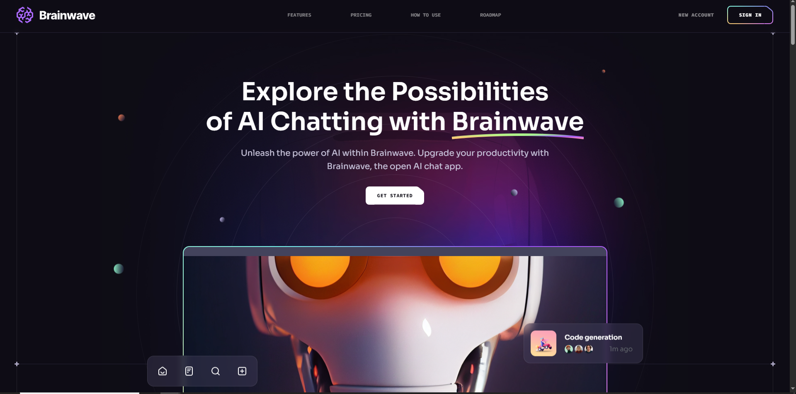

# 🧠 Brainwave — Modern UI/UX Website Clone

A fully responsive and animated landing page inspired by the **Brainwave** design, built using **React.js**, **Tailwind CSS**, and **Framer Motion**.

---

## 🚀 About The Project

This project replicates a high-quality modern web landing page with:

- Glassmorphism design elements.
- Smooth transitions and scroll animations.
- Fully mobile responsive layouts.
- Clean and modular React components.

It demonstrates real-world front-end design skills, and reflects modern web UI/UX practices.

---

## 🌟 Features

✅ Modern Glassmorphism Design  
✅ Smooth Animations with **Framer Motion**  
✅ Fully Responsive (Mobile, Tablet, Desktop)  
✅ Clean & Optimized Component Structure  
✅ Tailwind CSS for Rapid Styling  
✅ Reusable and Scalable Design Patterns  

---

## 🖼️ Screenshots

| Desktop View | Mobile View |
| ------------ | ----------- |
|  


---

## ⚙️ Tech Stack

- React.js ⚛️  
- Tailwind CSS 💨  
- Framer Motion 🎬  
- Vite / CRA ⚡  

---

## 💻 Getting Started

```bash
# 1️⃣ Clone the repository
git clone https://github.com/YourUsername/brainwave-ui-clone.git

# 2️⃣ Install dependencies
npm install

# 3️⃣ Start the development server
npm run dev

# 4️⃣ Visit in browser:
http://localhost:3000

